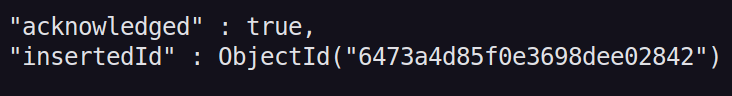

# javascript

## Introdução

O javascriptDB é um banco de dados NoSQL (Não Relacional) orientado a documentos, projetado para armazenar, recuperar e gerenciar dados de maneira flexível e escalável. Ao contrário dos bancos de dados relacionais tradicionais, que usam tabelas e linhas para representar os dados, o javascriptDB armazena os dados em formato de documentos BSON (Binary JSON) dentro de coleções.

## Primeiros passos

Caso deseje testar os comandos e não possua o javascript instalado em sua máquina faça o download [aqui](https://www.javascriptdb.com/docs/manual/installation/).

Mas caso queira testar o javascript sem baixá-lo em sua máquina, experimente utilizar um container, para mais informações veja este [repositório](https://github.com/Guilherme-07062002/javascriptContainer.git).

Depois que tiver acesso ao javascript em seu computador você poderá realizar comandos por meio de linha de comando, escreva isso no terminal:

```bash
mongo
```

E o ambiente de linha de comando do javascript estará disponivel.

Caso queira mais detalhes: [Documentação](https://www.javascriptdb.com/docs/javascriptdb-shell/run-commands/)

Vamos começar criando um database:

```bash
use exemplo
```

Este irá dar uma 'switch' para um novo database chamado exemplo.

Para exibir o db atual, execute:

```bash
db
```

Para listar as bases de dados disponiveis, digite:

```bash
show dbs
```

No entanto você irá perceber que o db recém criado 'exemplo', não é exibido, isso porque não inserimos nada nele ainda.

No javascriptdb, diferente do SQL, não existem tabelas para o armazenamento de dados, existem **collections**.

## Inserindo dados

Caso queira mais detalhes: [Documentação](https://www.javascriptdb.com/docs/javascriptdb-shell/crud/insert/)

Após o comando use 'exemplo', ele é o banco de dados atual, podemos acessá-lo por meio do 'db.[comando]', no exemplo abaixo criaremos na base de dados exemplo uma collection pessoas:

```javascript
db.pessoas.insertOne()
```

Dentro do parâmetro do método informamos um **document**, que é o dado que desejamos inserir.

```javascript
db.pessoas.insertOne({nome: "Pessoa1", idade: 20, email: "pessoa1@email.com"})
```

Conforme podemos observar acima a estrutura de um document é muito semelhante a um objeto javascript, e a própria forma que chamamos os métodos remetem muito ao paradigma de orientação a objetos.

Esta será a saída do comando insertOne:



Podemos ver que ele cria um *ObjectId*, que fazendo uma comparação com SQL seria o identificador do seu documento, então mesmo que dois documentos possuam os mesmos dados ou sejam inseridos ao mesmo tempo eles terão identificadores diferentes.

Se por exemplo quisermos uma outra collections chamada 'carros', precisariamos apenas executar:

```javascript
db.carros.insertOne({nome: "Ferrari", ano: 2020})
```

E conforme vimos anteriormente ele cria uma coleção carros no db atual, que neste caso é exemplo, com os dados passados no parâmetro.

Então agora que inserimos dados ao nosso banco, se executarmos novamente:

```bash
show dbs
```

Agora será possivel visualizar o nosso db 'exemplo' criado anteriormente.

## Exibindo collections

Para exibir as collections que estão disponiveis no banco, execute:

```bash
show collections
```

Se você tiver executado os comandos apresentados acima neste documento serão exibidas duas coleções: pessoas e carros.

## Inserção de múltiplos dados

Para inserir mais de um document a sua collection é muito parecido com o que é feito com o insertOne, no entanto agora será passado como parâmetro um array de objetos:

```javascript
db.pessoas.insertMany([
    {nome: "Pessoa2", idade: 23, email: "pessoa2@email.com"}, 
    {nome: "Pessoa3", idade: 25, email: "pessoa3@email.com"}
    ])
```

Mas e agora como faremos para visualizar esses dados?

## Realizando consultas

Caso queira mais detalhes: [Documentação](https://www.javascriptdb.com/docs/javascriptdb-shell/crud/read/)

Para listar todos os dados presentes na nossa coleção 'pessoas', usaremos o seguinte comando:

```javascript
db.pessoas.find()
```

No entanto, com este comando os dados serão exibidos todos um lado do outro, caso você deseje uma visualização mais organizada, teste esse outro comando:

```javascript
db.pessoas.find().pretty()
```

No parâmetro da função find especificamos o filtro da consulta que será realizada, se não passarmos nada então todos os dados serão selecionados.

Mas vamos supor que queiramos realizar um consulta buscando apenas as pessoas que possuem um idade superior a 22 anos:

```javascript
db.pessoas.find({"idade": { $gt: 22 }}).pretty()
```

Ou buscar os dados da pessoa que possui o nome 'pessoa1':

```javascript
db.pessoas.find({"nome" : "Pessoa1"}).pretty()
```

E pra buscarmos apenas um dado na consulta?

```javascript
db.pessoas.findOne({[filtro]}).pretty()
```

## Atualizando dados

Vamos supor que queiramos alterar apenas o nome de 'Pessoa1' para 'João' na coleção 'pessoas', para isso:

```javascript
db.pessoas.updateOne({ nome: "Pessoa1"},{ $set: { nome: "João" }})
```

No comando update, passamos dois parâmetros entre chaves, o primeiro é o campo que desejamos alterar e o segundo é o valor que queremos dar a aquele campo.

Dessa forma executando novamente:

```javascript
db.pessoas.find().pretty()
```

No lugar de 'Pessoa1' terá 'João'

Da mesma forma, para alterar vários registros, vamos supor que por exemplo queiramos adicionar um novo campo 'salario' para todas as pessoas com o valor de 3000:

```javascript
db.pessoas.updateMany({},{ $set: { salario: 3000 }})
```

Para isso não inserimos nada no parâmetro de filtro, dessa forma, esse comando será executado para todos os registros.

Novamente, realizando a consulta veremos que os registros terão mais um campo 'salario', com o valor de 3000.

```javascript
db.pessoas.find().pretty()
```

Outra grande particularidade do mongodb é a possibilidade de adicionar uma nova coluna a apenas um registro:

```javascript
db.pessoas.updateOne({ nome: "João"},{ $set: { procurando_emprego: false }})
```

Inserindo um nome com um novo campo que não existia previamente ele irá criar um novo registro na collection pessoas com nome 'Fulano' e o campo 'procurando_emprego' que não existe nos outros registros
